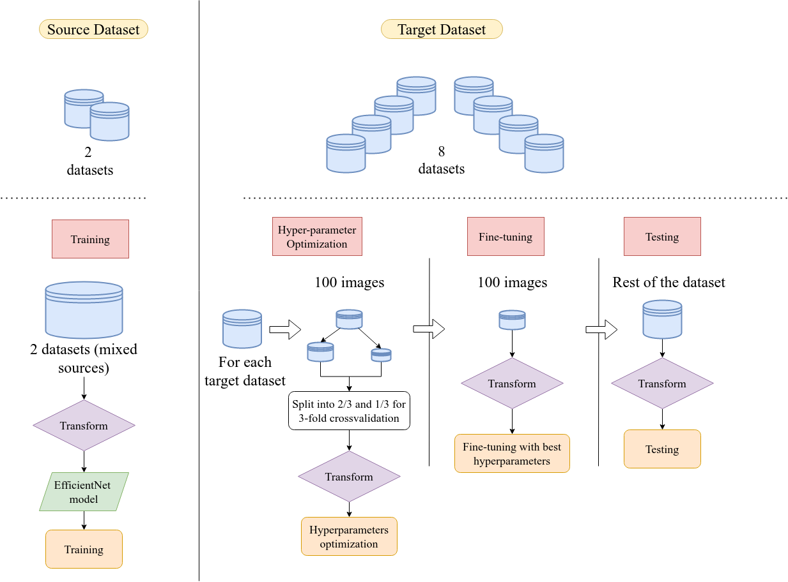

# Improving the Generalizability of White Blood Cell Classification with Few-Shot Domain Adaptation

This repository provides a framework to train a model on source datasets, fine-tune it on different target datasets, and visualize the results.

## Abstract


The morphological classification of nucleated blood cells is fundamental for the diagnosis of hematological diseases. Many Deep Learning algorithms have been implemented to automatize this classification task, but they most of the time fail to classify images coming from different sources. This is known as "domain shift". While some research has been conducted in this area, domain adaptation techniques are often computationally expensive and can introduce significant modifications to initial cell images. In this paper, we propose an easy-to-implement workflow where we trained a model to classify images from 2 datasets, and tested it on images coming from 8 other datasets. An EfficientNet model was trained on a source dataset comprising images from 2 different datasets. It was afterwards fine-tuned on each of the 8 target datasets by using 100 or less annotated images from these datasets. Images from both the source and the target dataset underwent a color transform to put them into a standardized color style. The importance of color transform and fine-tuning was evaluated through an ablation study and visually assessed with scatter plots, and an extensive error analysis was carried out. The model achieved an accuracy higher than 80 % for every dataset and exceeded 90 % for more than half of the datasets. The presented workflow yielded promising results in terms of generalizability, significantly improving performances on target datasets while keeping low computational cost and maintaining consistent color transformations.

## Overview



## Requirements

To install the project dependencies, run:

```bash
pip install -r requirements.txt
```
## Datasets
The datasets were not included in this Github but are all publicly available. You can find references in the source paper, Table 1. In order to load them in the right format, please have a look at the [data/README.md](data/README.md).

## Configuration

Modify the [config.py](src/config.py) file to set up the following parameters:

- **Source datasets** (`source`): Specify the datasets you want to use.
- **Number of images** (`size`): Set the number of images per dataset.
- **Balanced datasets** (`balanced`): Choose whether to balance datasets by labels.
- **Transformations** (`transform`): Enable or disable visual transformations.

### For training:
- **Fine-tuning** (`fine_tune=True`): Specify if you want to use only fine-tuning samples.
- **Model training parameters**: Set learning rate (`lr`), number of epochs (`epoch`), etc.

### For evaluation:
- **Full evaluation** (`full_evaluation=True`): Choose whether to use the entire target dataset, excluding samples used for fine-tuning.
- **Evaluation options**: Configure evaluation methods such as confusion matrix plotting (`plot_confusion`) or embedding visualization (`scatter_embeddings`).

## Training

To train or fine-tune the model, run the following command in the `src` folder:

```bash
python train.py
```

## Evaluation
To evaluate the model and generate visualizations, run the following command in the `src` folder:


```bash
python visualise.py
```